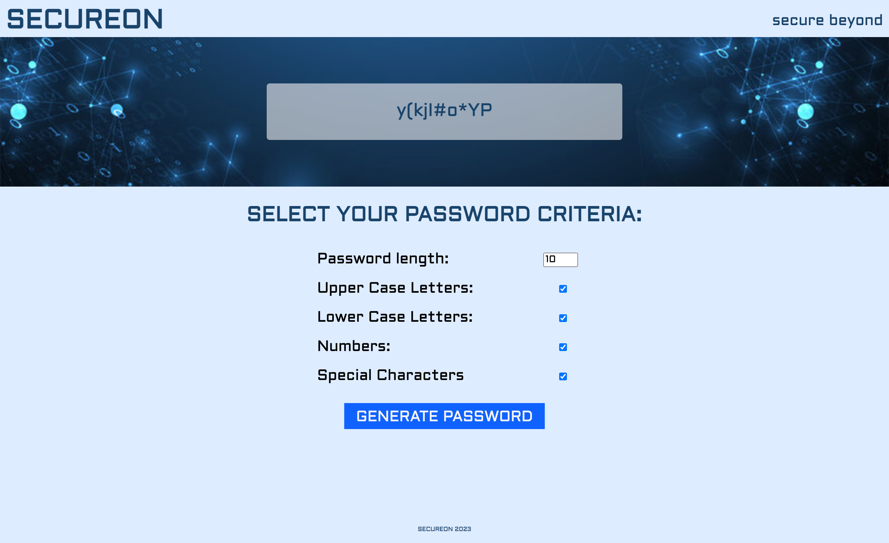

# 

## Table of Contents
- [Description](#description)
- [Learning Points](#learning-points)
- [Technology Used](#technology-used)
- [How to Get Started](#how-to-get-started)
- [Deployment](#deployment)
- [Author](#author)
- [Contributing](#contributing)
- [License](#license)

## Description

This is a simple yet powerful Password Generator website built using React. It allows users to generate strong and secure passwords for their various online accounts with ease. With customizable options and a user-friendly interface, this application makes it simple to create passwords that meet your specific security requirements.

 

## Learning Points

- How to use Create Vite.
- How to use React Components.
- How to style a React application.
- How to use the React State Hook.

 

## Technology Used

**Front End**
 

 &nbsp;&nbsp;&nbsp;&nbsp; 
 &nbsp;&nbsp;&nbsp;&nbsp; 
 &nbsp;&nbsp;&nbsp;&nbsp; 
 &nbsp;&nbsp;&nbsp;&nbsp; 

 

**Deployment**
 

 

| Technology Used | Resource URL                                                      |
| --------------- | ----------------------------------------------------------------- |
| Get Started With Netlify | [https://docs.netlify.com/get-started/](https://docs.netlify.com/get-started/) |
| React Quick Start | [https://react.dev/learn](https://react.dev/learn) |
| Using the State Hook | [https://legacy.reactjs.org/docs/hooks-state.html](https://legacy.reactjs.org/docs/hooks-state.html) |
| Forms | [https://legacy.reactjs.org/docs/forms.html](https://legacy.reactjs.org/docs/forms.html) |

 

## How to Get Started

1. Clone this repository to your local machine.
2. Navigate to the project directory and install the required dependencies using `npm install` and `npm run build`.
3. Launch the application with `npm run dev` and access it through your preferred web browser.
 

## Deployment

Website URL: [Secureon](https://secureon.netlify.app/)

 

## Author

### Lainey Creighton

**Contact me using the information below:**

 &nbsp;&nbsp;&nbsp;&nbsp; 
 &nbsp;&nbsp;&nbsp;&nbsp; 
 &nbsp;&nbsp;&nbsp;&nbsp; 

 

## Contributing

Contributions are welcome! If you encounter any issues or have suggestions for improvements, please feel free to submit a pull request.
 

## License

N/A